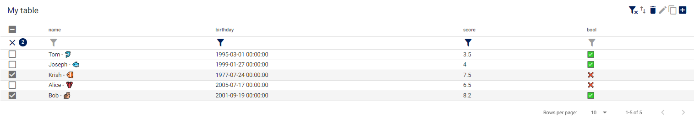

# ipyvuetable

Fast and customizable table widget for the Jupyter ecosystem build on [ipyvuetify](https://github.com/widgetti/ipyvuetify) and [Polars](https://github.com/pola-rs/polars).

ipyvuetable can sort, filter, edit large `polars.LazyFrame` in a paginated way. 
You can easily customize you table widget, add actions, hide columns, add special visualisation for some columns and benefit from all the ipyvuetify customization

```python
from ipyvuetable import EditingTable, Table
import polars as pl
df = (
    pl.LazyFrame({
        'id': range(6), 
        'name': ['Tom', 'Joseph', 'Krish', 'John', 'Alice', 'Bod'],
        'birthday': ['01-03-1995', '27-01-1999', '24-07-1977', '27-12-1970', '17-07-2005', '19-09-2001'],
        'score': [3.5, 4.0, 7.5, 1.0, 6.5, 8.2],
        'bool': [True, True, False, True, False, True]
    })
    .with_columns(pl.col('birthday').str.strptime(pl.Datetime, "%d-%m-%Y"))
)

name_custom_repr = pl.LazyFrame({
    'name' : ['Tom', 'Joseph', 'Krish', 'John', 'Alice', 'Bod'],
    'name__repr' : ['Tom - 🐬', 'Joseph - 🐟', 'Krish - 🐠 ', 'John - 🦐', 'Alice - 🦞', 'Bob - 🐌']
})

EditingTable(
    df = df, 
    title = 'My table', 
    
    show_actions= True,
    show_filters=True,
    columns_to_hide = ['id'],
    
    # all ipyvuetify options
    show_select = True,
    
    columns_repr = {'name' : name_custom_repr}
)
```


## Installation

Install the latest ipyvuetable version with:

```sh
pip install ipyvuetable
```

Benefit from keyboard events with:

```sh
pip install ipyvuetable[ipyevents]
```